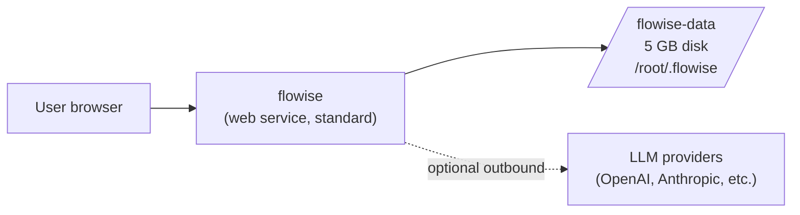

# Flowise on Render (SQLite + Disk)

> Self-host Flowise to build LLM agents and workflows visually, with the simplest single-instance setup on Render.

[](https://render.com/deploy-template/api/github/start?template_repo=flowise-render-template)

This template runs the official `flowiseai/flowise` Docker image on a Render web service with SQLite on a persistent disk. It's the quickest way to stand up Flowise for a single team or a personal lab. If you need horizontal scaling, multi-instance deploys, or production-grade managed Postgres, use the [Postgres variant](https://github.com/render-examples/flowise-render-template-postgres) instead.


---

## Table of contents

- [Why deploy Flowise on Render](#why-deploy-flowise-on-render)
- [Use cases](#use-cases)
- [What gets deployed](#what-gets-deployed)
- [Quickstart](#quickstart)
- [Configuration](#configuration)
- [Cost breakdown](#cost-breakdown)
- [Customization](#customization)
- [Operations](#operations)
- [Upgrading](#upgrading)
- [Troubleshooting](#troubleshooting)
- [FAQ](#faq)
- [Security](#security)
- [Caveats and limitations](#caveats-and-limitations)
- [Credits and license](#credits-and-license)

---

## Why deploy Flowise on Render

- **Two-file template, one click.** No Dockerfile to maintain, no `docker compose` to keep in sync — just `render.yaml` and this README.
- **Disk snapshots replace your backup script.** Render takes point-in-time snapshots of the persistent disk, including the SQLite database, encryption keys, and uploads.
- **Auto-generated encryption keys persist across restarts.** Flowise writes its encryption key to `SECRETKEY_PATH` on the persistent disk, so credentials you save stay decryptable across deploys without you handling secrets.
- **TLS, custom domains, and a `*.onrender.com` URL out of the box.** No reverse proxy to configure.

## Use cases

What people build on this template:

- **RAG chatbot over private docs** — wire a document loader → vector store → chat node and embed it in a customer portal
- **Internal LLM workflow runner** — automate ops tasks (summaries, triage, drafting) without writing Python
- **Agent prototyping sandbox** — wire LangChain agents visually before committing them to code
- **Customer-support copilot** — connect Slack/Discord/Webhook triggers to an agent that reads from your KB
- **MCP-tool exploration** — Flowise speaks MCP, so this becomes a UI for testing MCP servers you're building

## What gets deployed



| Resource | Type | Plan | Purpose |
|----------|------|------|---------|
| `flowise` | Web service (`runtime: image`) | `standard` (2 GB / 1 CPU) | Runs `docker.io/flowiseai/flowise:latest`, serves the UI and API on `$PORT` |
| `flowise-data` | Persistent disk | 5 GB | SQLite database, encryption keys, auth secrets, logs, file uploads — everything Flowise needs to persist |

The `standard` plan is the floor: Flowise's Node process exceeds the `starter` plan's 512 MB during startup and OOMs before binding the port. See [Caveats](#caveats-and-limitations) for the details.

Region defaults to **`oregon`**. Override in `render.yaml` if you'd rather deploy in Frankfurt, Singapore, Ohio, or anywhere else Render supports.

## Quickstart

1. Click **[Deploy to Render](https://render.com/deploy-template/api/github/start?template_repo=flowise-render-template)**.
2. Authorize the Render GitHub App if prompted, choose a destination Git account, and let Render fork this template into your account.
3. On the Blueprint Apply screen, confirm the resources (1 web service + 1 disk). No secrets to fill in — Flowise creates its own.
4. Click **Apply**. The first deploy takes ~90 seconds to pull the image and another ~30 seconds to boot.
5. Once the service shows **Live**, open the `*.onrender.com` URL from the dashboard. Flowise will prompt you to create the first admin account directly in the UI.

After your first login, [the Flowise quickstart](https://docs.flowiseai.com/getting-started) walks through building your first chatflow.

## Configuration

Every env var below is set by [`render.yaml`](./render.yaml). You don't need to touch any of them to deploy; tweak only if you have a reason.

### Required secrets

**None.** Flowise creates its first admin user in-app on the initial visit, and all cryptographic secrets are auto-generated and stored on the persistent disk under `SECRETKEY_PATH`.

If you'd rather harden secrets via env vars, see [Customization → Move secrets to env vars](#move-secrets-to-env-vars).

### Auto-generated secrets

Flowise generates these on first boot and writes them to `/root/.flowise/` on the persistent disk:

| File | Purpose | What breaks if you delete it |
|------|---------|------------------------------|
| `encryption.key` | Encrypts stored credentials (LLM API keys, DB creds, etc.) | Every saved credential becomes unreadable |
| `auth/jwt_auth_token_secret` | Signs auth JWTs | All active sessions invalidate; users must log in again |
| `auth/jwt_refresh_token_secret` | Signs refresh JWTs | Refresh tokens stop working; users must log in again |
| `auth/express_session_secret` | Signs Express session cookies | Same as above |
| `auth/token_hash_secret` | Hashes one-time tokens (invites, password resets) | Outstanding invites/resets stop working |

**Do not delete the disk.** Snapshot it before any risky operation.

### Wired automatically

This template has no inter-service wiring (single service). The Postgres variant uses `fromDatabase` references for `DATABASE_HOST` / `DATABASE_PORT` / etc.

### Optional tweaks

| Env var | Default | What it does |
|---------|---------|--------------|
| `NODE_OPTIONS` | `--max-old-space-size=460` | Bumps Node's heap so Flowise doesn't OOM on the `starter` plan's 512 MB container. Raise to `~1800` if you upgrade to `standard`, or higher on `pro`. |
| `LOG_LEVEL` | `info` | Set to `warn` or `error` to quiet noisy logs, `debug` while triaging |
| `NUMBER_OF_PROXIES` | `1` | Number of upstream proxies in front of Flowise (Render's edge counts as 1; leave as-is) |
| `TRUST_PROXY` | `true` | Required so Flowise reads `X-Forwarded-*` correctly behind Render's edge |
| `DISABLE_FLOWISE_TELEMETRY` | `true` | Disable upstream analytics; flip to `false` to opt in |
| `FLOWISE_FILE_SIZE_LIMIT` | upstream default `50mb` | Cap on file uploads; raise for larger PDFs/CSVs (watch disk fill) |
| `CORS_ORIGINS` | `*` | Restrict the API to specific frontends |
| `IFRAME_ORIGINS` | `*` | Restrict who can embed Flowise via iframe |
| `MODEL_LIST_CONFIG_JSON` | unset | Path to a custom `models.json` to override the built-in model list |
| `DISABLED_NODES` | unset | Comma-separated node names to hide from the editor (e.g. `bufferMemory,chatOpenAI`) |

Full upstream config reference: [Flowise Environment Variables](https://docs.flowiseai.com/configuration/environment-variables).

## Cost breakdown

| Resource | Plan | Monthly cost |
|----------|------|--------------|
| `flowise` web service | `standard` (1 CPU, 2 GB) | $25.00 |
| `flowise-data` disk | 5 GB SSD | $0.50 |
| **Total** | | **~$25.50** |

Pricing source: [render.com/pricing](https://render.com/pricing).

**Why standard is the floor**

The `starter` plan (512 MB) is not enough for Flowise — the Node process OOMs during startup before it can bind a port. `standard` (2 GB) handles startup comfortably and leaves room for light chatflow execution.

**Scale up**

- Bump `plan` to `pro` (2 CPU, 4 GB) when you start running large RAG ingests or many concurrent chatflows.
- Increase `disk.sizeGB` (max 1 TB on standard plans).
- Switch to the [Postgres variant](https://github.com/render-examples/flowise-render-template-postgres) for production workloads, then drop the disk and move uploads to S3 to unlock horizontal scaling.

## Customization

### Pin the upstream version

This template defaults to `flowiseai/flowise:latest`, which is mutable. For predictable deploys, pin to a specific upstream release:

```yaml
# render.yaml
services:
  - type: web
    name: flowise
    runtime: image
    image:
      url: docker.io/flowiseai/flowise:3.1.2   # pick from https://hub.docker.com/r/flowiseai/flowise/tags
```

For maximum reproducibility, pin to a digest:

```yaml
      url: docker.io/flowiseai/flowise@sha256:<digest>
```

### Add a custom domain

1. In the Render dashboard, open the `flowise` service → **Settings** → **Custom Domains** → **Add**.
2. Add a CNAME from your domain to the `*.onrender.com` hostname (or an A/ALIAS record for an apex domain).
3. Render issues TLS automatically once DNS resolves.

DNS specifics: [Render custom domains](https://render.com/docs/custom-domains).

### Move file uploads off the disk

Move `BLOB_STORAGE_PATH` content to S3-compatible storage. Lets you shrink (or remove) the disk and is a prerequisite for horizontal scaling. **Note:** you must keep the disk for `SECRETKEY_PATH` unless you also switch to env-var secrets — see the next section.

```yaml
# render.yaml
envVars:
  - key: STORAGE_TYPE
    value: s3
  - key: S3_STORAGE_BUCKET_NAME
    value: my-flowise-uploads
  - key: S3_STORAGE_REGION
    value: us-west-2
  - key: S3_STORAGE_ACCESS_KEY_ID
    sync: false
  - key: S3_STORAGE_SECRET_ACCESS_KEY
    sync: false
```

### Move secrets to env vars

To run multi-instance, you need secrets in env vars instead of on disk. Set these and Flowise will use them instead of generating files:

```yaml
envVars:
  - key: FLOWISE_SECRETKEY_OVERWRITE
    generateValue: true
  - key: JWT_AUTH_TOKEN_SECRET
    generateValue: true
  - key: JWT_REFRESH_TOKEN_SECRET
    generateValue: true
  - key: EXPRESS_SESSION_SECRET
    generateValue: true
  - key: TOKEN_HASH_SECRET
    generateValue: true
```

Rotating any of these later breaks your existing data (saved credentials become unreadable, sessions invalidate). Generate once and leave alone.

### Switch to AWS Secrets Manager

For enterprise setups, point Flowise at AWS Secrets Manager instead of local files or env vars:

```yaml
envVars:
  - key: SECRETKEY_STORAGE_TYPE
    value: aws
  - key: SECRETKEY_AWS_REGION
    value: us-west-2
  - key: SECRETKEY_AWS_NAME
    value: FlowiseEncryptionKey
  - key: SECRETKEY_AWS_ACCESS_KEY
    sync: false
  - key: SECRETKEY_AWS_SECRET_KEY
    sync: false
```

## Operations

### Backups

- **Disk snapshots:** Render takes daily snapshots of the persistent disk. Manage them under the disk in the dashboard. Restoring a snapshot recovers the SQLite DB, all encryption keys, and all uploads in one operation.
- **Manual export:** SSH into the service (`render ssh <service-id>`) and `cp -r /root/.flowise /tmp/backup.tgz` if you need an ad-hoc archive.
- **What's not backed up:** runtime env var values (these live in Render's config, not the disk). If you rotate or lose them, redeploying restores defaults from `render.yaml`.

### Monitoring

- **Health check:** `render.yaml` sets `healthCheckPath: /api/v1/ping`. Render polls this; a non-200 marks the service unhealthy and restarts it.
- **Dashboard metrics:** Open the service → **Metrics** for CPU, memory, request rate, response time, and bandwidth.
- **Flowise built-in metrics:** Enable by setting `ENABLE_METRICS=true` (Prometheus exporter on `/api/v1/metrics`).

### Scaling

This template **cannot scale horizontally** — the persistent disk pins the service to one instance. To scale:

1. Move uploads off the disk ([recipe above](#move-file-uploads-off-the-disk)).
2. Move secrets off the disk ([recipe above](#move-secrets-to-env-vars)).
3. Switch SQLite → Postgres (use the [Postgres variant template](https://github.com/render-examples/flowise-render-template-postgres)).
4. Remove the `disk:` block, set `scaling.numInstances: 2` (or higher), and redeploy.

Once the disk is gone, Render also runs zero-downtime deploys instead of restart-style ones.

### Logs

- Dashboard: service → **Logs** for live streaming.
- CLI: `render logs --resources <service-id> --tail`.
- Persisted logs live in `/root/.flowise/logs` on the disk if `LOG_PATH` is set (it is by default).

## Upgrading

### Pick up upstream releases

- **Easy mode (`latest` tag):** Dashboard → service → **Manual Deploy** → **Deploy latest commit**. Render re-pulls the `latest` tag.
- **Pinned mode (recommended for production):** Edit `image.url` in `render.yaml` to the new version, commit, push. Render auto-deploys on the new tag.

Subscribe to the [Flowise releases feed](https://github.com/FlowiseAI/Flowise/releases) so you know when to bump.

### Breaking-change migrations

Notable migrations across Flowise major versions:

- **v3.x → onwards:** auth moved fully in-app; the `FLOWISE_USERNAME` / `FLOWISE_PASSWORD` env vars no longer exist. This template never used them, so no action.
- **Future migrations:** check the upstream [CHANGELOG](https://github.com/FlowiseAI/Flowise/releases) before bumping a major version. Always snapshot the disk first.

## Troubleshooting

### Deploy fails during image pull

**Symptom:** Deploy event shows `failed to pull image` or hangs on `Pulling docker.io/flowiseai/flowise:latest`.

**Cause:** Docker Hub rate limiting or a transient network issue.

**Fix:** Trigger a manual redeploy after a few minutes. If it persists, pin to a specific version tag (Docker Hub rate-limits anonymous `latest` pulls more aggressively).

### Health check fails after a successful build

**Symptom:** Service shows **Deploy failed** with `Health check failed at /api/v1/ping`.

**Cause:** Usually `PORT` mismatch or the disk failed to mount.

**Fix:** Check the service logs for `EADDRINUSE` or `EACCES`. Confirm `PORT=3000` is set and that the disk shows **Mounted** under the service's **Disks** tab.

### `No open ports detected` + `Reached heap limit Allocation failed - JavaScript heap out of memory`

**Symptom:** Logs show Flowise starting (Data Source / migrations / Identity Manager init lines) followed by GC warnings, a `Reached heap limit Allocation failed` fatal error, and the service exits with status `139`. Render's port scanner gives up because the process keeps dying before binding.

**Cause:** The web service is on the `starter` plan (512 MB), which is too small for Flowise's Node process at startup. The default Node heap is also small, and Flowise blows through ~250 MB before Identity Manager finishes.

**Fix:** Edit `render.yaml`, set `plan: standard` (2 GB / 1 CPU), commit, push. This template ships with `standard` already; you only hit this if you manually downgraded the plan. NODE_OPTIONS / `--max-old-space-size` tweaks alone are not enough — Flowise genuinely needs more RAM than `starter` provides.

### Can't log in / "decryption failed" errors

**Symptom:** UI shows "decryption failed" or saved credentials no longer work.

**Cause:** The encryption key on the disk changed (disk was rebuilt, or you set `FLOWISE_SECRETKEY_OVERWRITE` to a different value after the fact).

**Fix:** Restore the latest disk snapshot. If you have no snapshot, you'll have to delete the affected credentials in the UI and re-enter them.

### "database is locked" in logs under load

**Symptom:** Intermittent SQLite errors under concurrent requests.

**Cause:** SQLite serializes writes. This is the expected limit of this template.

**Fix:** Switch to the [Postgres variant template](https://github.com/render-examples/flowise-render-template-postgres).

### Anything else

- Service logs: dashboard → **Logs** (or `render logs --resources <id> --tail`)
- Deploy logs: dashboard → **Events** → click the failed deploy
- Template bugs: [open an issue in this repo](https://github.com/render-examples/flowise-render-template/issues)
- Flowise bugs: [open an issue upstream](https://github.com/FlowiseAI/Flowise/issues)

## FAQ

### Can I run this on Render's free or starter plan?

No. The `starter` plan's 512 MB is below Flowise's minimum startup memory — the Node process OOMs before binding the port. The `free` plan additionally does not support persistent disks. `standard` (2 GB) is the floor for Flowise on Render regardless of variant.

### How do I migrate from an existing self-hosted Flowise?

1. Deploy this template.
2. SSH in: `render ssh <service-id>`.
3. Replace `/root/.flowise/database.sqlite` and `/root/.flowise/encryption.key` with your originals (`scp` or `cat` paste from local).
4. Restart the service.

Test on a non-production Render instance first.

### What happens if I delete the disk?

You lose every chatflow, every saved credential, every uploaded file, and every active session. **Always snapshot before deleting.**

### Can I move my data to Postgres later?

Yes. Flowise has built-in support for SQLite → Postgres migration via its dump/restore tooling. Pattern:

1. Deploy the [Postgres variant template](https://github.com/render-examples/flowise-render-template-postgres) alongside this one.
2. SSH into the SQLite instance, dump chatflows via the Flowise API.
3. Use the Flowise Import UI on the Postgres instance to restore.

### Why deploy on Render and not Docker locally?

Local Docker is fine for prototyping. Render gives you: managed TLS + custom domain, automatic restarts when the process crashes, disk snapshots, deploy history with rollback, and a public URL you can share with teammates.

### Why pick this template over building from source?

This template uses `runtime: image` to pull the upstream Docker image directly. Building Flowise from source on every deploy means a ~4 GB Node heap and several minutes of pnpm + turbo work — wasteful when the upstream already publishes the same image. If you need to customize the source, fork [FlowiseAI/Flowise](https://github.com/FlowiseAI/Flowise) and switch this template to `runtime: docker` pointing at your fork.

### Does this support Flowise's queue mode (BullMQ + Redis)?

Not in this template — that's an upcoming variant. For now, leave `MODE` unset (defaults to `main`) and run a single instance. Queue mode requires a Render Key Value (Redis) instance and a separate worker service.

## Security

- **Encryption at rest:** Render's persistent disks are encrypted at the storage layer. Flowise additionally encrypts stored credentials (LLM API keys, DB creds) at the application layer using the key at `SECRETKEY_PATH`.
- **Encryption in transit:** TLS terminates at Render's edge for the `*.onrender.com` hostname and any custom domains you add. Outbound calls to LLM providers go over TLS.
- **Network exposure:** The web service is public on port `$PORT`. There is no admin-only port; access control is enforced inside Flowise via the admin account you create.
- **Secret rotation:** Safe to rotate: `LOG_LEVEL`, optional config knobs. **Dangerous to rotate**: anything in `/root/.flowise/encryption.key` or `/root/.flowise/auth/`. Rotating breaks every saved credential and invalidates every session.
- **Vulnerability reports:**
  - Template bugs → [this repo's issues](https://github.com/render-examples/flowise-render-template/issues)
  - Flowise application vulnerabilities → [FlowiseAI security policy](https://github.com/FlowiseAI/Flowise/security/policy)

## Caveats and limitations

- **Standard plan is the floor.** Flowise's Node process exceeds the `starter` plan's 512 MB during startup (the JS heap alone climbs past ~250 MB before Identity Manager finishes initializing) and OOMs before binding the port. The template uses `standard` (2 GB) so it deploys cleanly out of the box. Downgrading to `starter` will fail with `Reached heap limit Allocation failed - JavaScript heap out of memory` and `No open ports detected`.
- **Single instance only.** The persistent disk pins this template to one instance and to restart-style deploys (~5 seconds of downtime per deploy, not zero-downtime).
- **Image tag drift.** `latest` is mutable; subsequent deploys may behave differently than your first one. Pin a version for production.
- **First image pull is slow.** ~90 seconds on cold caches. Subsequent deploys reuse the cached layer.
- **No automatic upstream upgrades.** Render does not auto-redeploy when the upstream pushes a new image. Use a [deploy hook](https://render.com/docs/deploy-hooks) wired to upstream releases if you want this.
- **Region pinning.** The web service and disk must be in the same region. Choose carefully — you can't move a disk across regions without a snapshot restore.
- **SQLite concurrency.** Flowise serializes writes; high-concurrency workloads need the Postgres variant.

## Credits and license

- **Upstream:** [FlowiseAI/Flowise](https://github.com/FlowiseAI/Flowise) — Apache 2.0
- **Render template:** MIT — see [LICENSE](./LICENSE)
- **Template maintainer:** [@render-examples](https://github.com/render-examples)

If this template helped you, give the [upstream repo](https://github.com/FlowiseAI/Flowise) a star.
